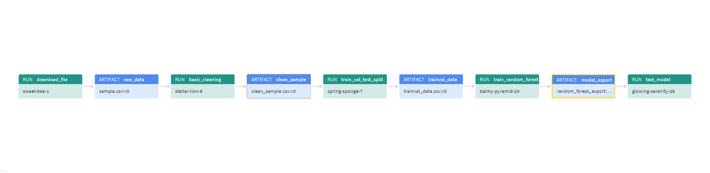

# Build an ML Pipeline for Short-Term Rental Prices in NYC


In this project we will build a reusable machine learning pipeline to train a model on weekly cadence and identify the typical price for the given property based on the similar property.

## Project Links

```
Weights & Biases project link: https://wandb.ai/prathmesh-dali/nyc_airbnb?workspace=user-prathmesh-dali
Github repository link: https://github.com/prathmesh-dali/build-ml-pipeline-for-short-term-rental-prices
```

## Prerequisits 

Make sure to have conda installed and ready, then create a new environment using the ``environment.yml``
file provided in the root of the repository and activate it:

```bash
> conda env create -f environment.yml
> conda activate nyc_airbnb_dev
```

### Get API key for Weights and Biases
Let's make sure we are logged in to Weights & Biases. Get your API key from W&B by going to 
[https://wandb.ai/authorize](https://wandb.ai/authorize) and click on the + icon (copy to clipboard), 
then paste your key into this command:

```bash
> wandb login [your API key]
```

You should see a message similar to:
```
wandb: Appending key for api.wandb.ai to your netrc file: /home/[your username]/.netrc
```

## Running the entire pipeline or just a selection of steps
In order to run the pipeline, you need to be in the root of the starter kit, 
then you can execute as usual:

```bash
>  mlflow run .
```
This will run the entire pipeline.

You can run individual step say you want to run only
the ``download`` step:

```bash
> mlflow run . -P steps=download
```
If you want to run the ``download`` and the ``basic_cleaning`` steps, you can similarly do:
```bash
> mlflow run . -P steps=download,basic_cleaning
```
You can override any other parameter in the configuration file using the Hydra syntax, by
providing it as a ``hydra_options`` parameter. For example, say that we want to set the parameter
modeling -> random_forest -> n_estimators to 10 and etl->min_price to 50:

```bash
> mlflow run . \
  -P steps=download,basic_cleaning \
  -P hydra_options="modeling.random_forest.n_estimators=10 etl.min_price=50"
```

To run the pipeline with multiple values of hydra parameters use ``-m`` in the hydra_options.

### Different steps of pipeline present:
 ``download``
    ``basic_cleaning``
    ``data_check``
    ``data_split``
    ``train_random_forest``, ``test_regression_model``

## Pipeline

The Lineage of pipeline looks as below on W&B



## To execute pipeline directly from github
Activate the above installed conda environment and execute follwing command:

```
mlflow run https://github.com/prathmesh-dali/build-ml-pipeline-for-short-term-rental-prices.git -v [Valid Tag number] -P hydra_options="[Any parameter e.g input file path]"
```

## License

[License](LICENSE.txt)
